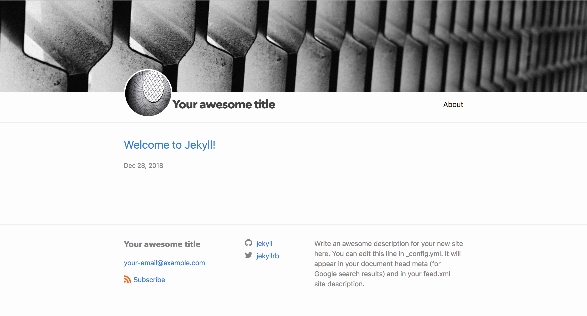
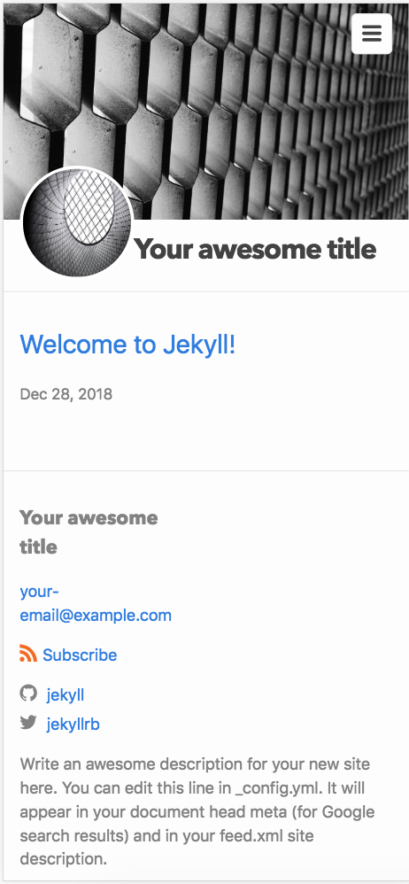

# miniscule

A slightly-less-minimal theme for Jekyll. Forked from the [default minima theme](https://github.com/Jekyll/minima)

[Theme preview](http://ronenagranat.com/)

## Screenshots




## Installation

First, install Jekyll and create a new site following the instructions on the [official webpage](https://jekyllrb.com/):


    gem install bundler jekyll
    jekyll new my-awesome-site
    cd my-awesome-site

*Then:*

Add this line to your Jekyll site's Gemfile:

```ruby
gem "miniscule"
```

And add this line to your Jekyll site:

```yaml
theme: miniscule
```

And then execute:

    $ bundle

to install and enable the theme.

## Build and run

To build:

    $ bundle exec jekyll build

To run:

    $ bundle exec jekyll serve

## Features

* Cover photo

* Profile picture

* Twitter feed

## Usage

General usage is much as the same as the `minima` theme from which this theme is forked.
Please see the [minima theme usage guide](https://github.com/jekyll/minima/blob/master/README.md#usage)

Please also see the [example blog](https://github.com/ronen-agranat/ronenagranat) for practical usage examples.

### Profile photo

In `_config.yml`:

```yaml
logo: path/to/profile/image.jpg
```

### Cover photo

In `_config.yml`:

```yaml
cover_image: path/to/cover/image.jpg
```

### Twitter feed

In `_config.yml`:

```yaml
twitter_username: yourtwitterhandle
show_twitter_feed: true
```

### Fork me

Shows a GitHub 'fork me' link in the top corner of the page, as
well as a link in the footer.

In `_config.yml`:

```yaml
fork_me_url: https://example.com
show_fork_me: true
```

## License

The theme is available as open source under the terms of the [MIT License](http://opensource.org/licenses/MIT).
